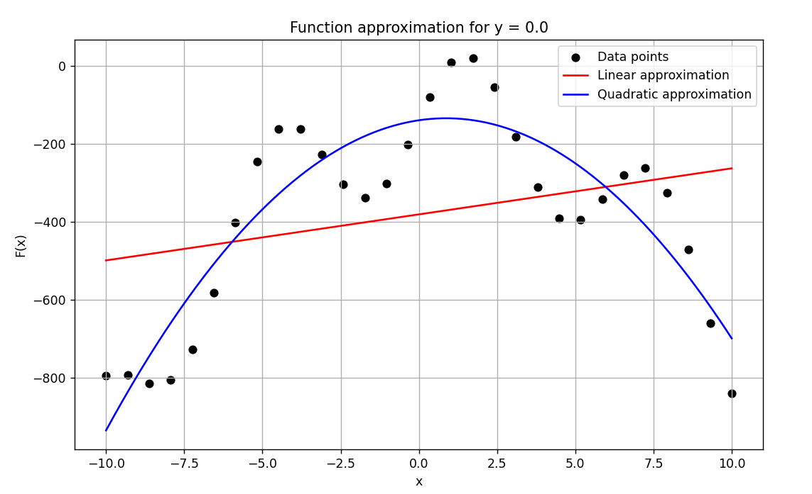

# Numerical Methods Toolkit for Scientific Computation

A modular Python-based implementation of core numerical methods — including interpolation, approximation, integration, and differentiation — applied to a bivariate function F(x,y). The project focuses on **transparent implementation, method comparison, and visual verification**, without relying on high-level scientific libraries.

>Originally developed as part of a university course in numerical algorithms, this project has been extended and structured to serve as a practical toolkit for scientific computing and algorithmic validation.

---

## Key Features

- Manual implementation of core numerical methods

- Visualization of multidimensional function layers

- Performance and error metric comparison across methods

- Clean structure with documented logic and visual output

- No reliance on scipy, sympy, or machine learning libraries

---

## Technologies Used

- **Python 3.10+**
- **NumPy** - numerical array operations
- **Matplotlib** - data visualization
- Built-in `math` library - for low-level computation

>Note: All numerical logic implemented manually. No high-level numerical libraries allowed due to course constraints - reflecting strong algorithmic understanding.

---

## Features & Methods

### Preprocessing & Visualization

- Visualization of F(x,y) slices for different y values

- Statistical analysis: mean, median, standard deviation per layer

### Interpolation

- Lagrange polynomial interpolation

- Cubic spline interpolation

- Accuracy comparison via MAE, MSE, and max error

### Function Approximation

- Linear and quadratic least squares fitting

- Metrics: RMSE, R² score

- Overlay of original vs approximated data

### Numerical Integration

- Trapezoidal rule

- Simpson's rule

- Convergence analysis by step size

### Numerical Differentiation
- Finite difference approximations of partial derivatives

- Error analysis vs sample resolution

- Monotonicity detection based on sign of derivatives

---

## Repository Structure

<pre>
📁 numerical-algorithms-project/
└── 📁images/ # Generated plots used in report
    ├── 🖼️plot1.png
    ├── 🖼️plot2.png
    └── 🖼️plot3.png
├── 📄 .gitignore # Files and folders to ignore in Git version control
├── 📄 data.txt # Input data file (x, y, F(x,y))
├── 📄 project.py # Main Python script with all code
├── 📄 README.md # This file
└── 📄 report.pdf # Full report with plots and method descriptions  
</pre>
---

## Sample Input Format

The data.txt file contains tab-separated values in the following format:

```
x          y      	f(x,y)
-10.00000 -10.00000 -293.73141
-9.31034 -10.00000 -184.15177
...
```

- Input is expected to be clean and prevalidated

- Function values assumed to be smooth and continuous

- Missing or malformed entries are not automatically handled

## How to Run

1. Clone this repository:

```bash
git clone https://github.com/klaudiawoch/numerical-algorithms.git
cd numerical-algorithms
```

2. Ensure you have Python 3.10+ and required packages installed:

`pip install numpy matplotlib`

3. Run the script:

`python project.py`

>Make sure that the data.txt file is in the same directory as project.py.

For a detailed description of all methods, visual results, equations, and conclusions, see the full report:

[View Report](report.pdf)

The report includes:

- Graphical output for each method

- Mathematical foundations

- Implementation details

- Methodological insights and performance evaluation

## Author & Motivation
A first-year Computer Science student with foundational programming skills and academic exposure to numerical methods. While still exploring various areas of software development, this project demonstrates the ability to implement and analyze mathematical algorithms from scratch. Motivated to build practical experience and deepen understanding of computational techniques through hands-on projects.

## Limitations
 - No automated tests (not required in scope of the course).

- Single-file implementation due to course constraints.

- Only basic libraries allowed – no scipy, sympy, or machine learning tools.

## Sample Visuals
Here are a few selected plots generated by the script:





## License
Licensed under MIT — free to use, modify, and share with attribution.

## Got feedback?
Open an issue or contact via GitHub. Always open to collaboration or critique.